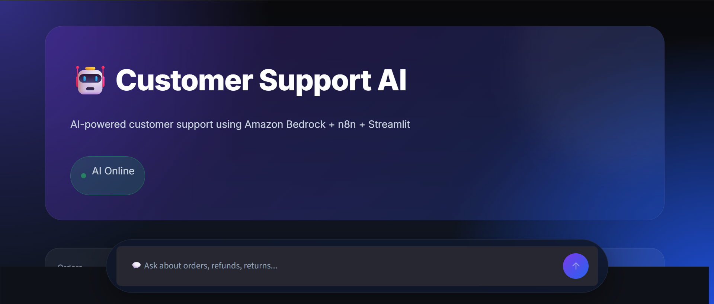
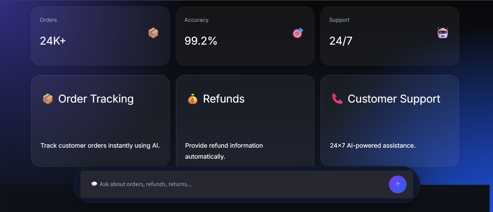
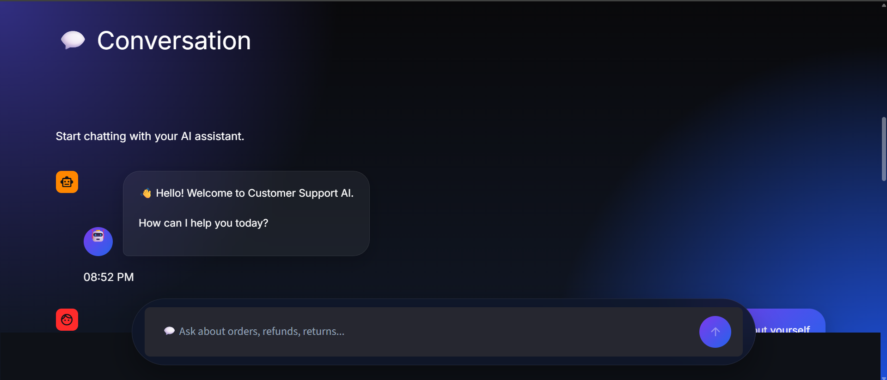
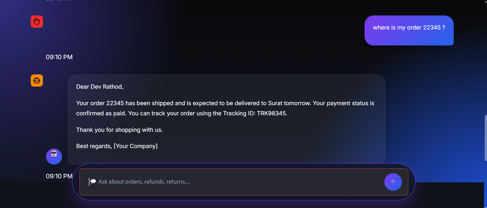
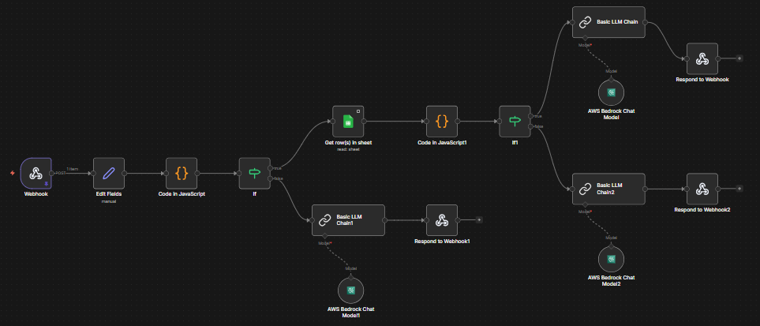

<<<<<<< HEAD
# 🤖 Customer Support AI Chatbot

> An AI-powered Customer Support Chatbot built using **Python**, **Streamlit**, **n8n**, and **Amazon Bedrock** to automate customer service tasks like order tracking, refund inquiries, return policies, and support assistance through intelligent workflow automation.

---

# 📸 Project Preview

> Replace these images with your screenshots.

## Home Screen




---

## Chat Interface




---

## n8n Workflow



---

# 🚀 Features

✅ AI-powered Customer Support

✅ Order Tracking

✅ Refund Information

✅ Return Policy Assistance

✅ FAQ Automation

✅ Session-based Conversation

✅ Amazon Bedrock Integration

✅ n8n Workflow Automation

✅ Modern Glassmorphism UI

✅ Responsive Design

✅ Clean Chat History

✅ Export Conversation

---

# 🛠 Tech Stack

| Technology | Purpose |
|------------|----------|
| Python | Backend |
| Streamlit | Frontend UI |
| n8n | Workflow Automation |
| Amazon Bedrock | Large Language Model |
| AWS IAM | Authentication |
| REST API | Communication |
| HTML/CSS | UI Customization |
| Requests | API Calls |

---

# 🏗 Project Architecture

```
                    User
                      │
                      ▼
           Streamlit Web Interface
                      │
               HTTP Webhook
                      │
                      ▼
              n8n Workflow Engine
                      │
         Amazon Bedrock Chat Model
                      │
                      ▼
                AI Response
                      │
                      ▼
               Streamlit UI
```

---

# ⚙ Workflow

```
User Question

↓

Streamlit

↓

HTTP POST Request

↓

n8n Webhook

↓

Amazon Bedrock

↓

Generate Response

↓

Return to Streamlit

↓

Display Chat
```

---

# 📂 Project Structure

```
customer-support-ai/

│

├── app.py

├── components.py

├── utils.py

├── styles.css

├── requirements.txt

├── README.md

│

├── assets/

│   ├── chatbot.png

│   ├── background.jpg

│

├── screenshots/

│   ├── home.png

│   ├── chat.png

│   ├── sidebar.png

│   └── workflow.png

│

└── workflow/

    └── customer-support-workflow.json
```

---

# 📦 Installation

## Clone Repository

```bash
git clone https://github.com/YOUR_USERNAME/customer-support-ai.git

cd customer-support-ai
```

---

## Create Virtual Environment

```bash
python -m venv venv
```

Windows

```bash
venv\Scripts\activate
```

Linux / Mac

```bash
source venv/bin/activate
```

---

## Install Requirements

```bash
pip install -r requirements.txt
```

---

## Run n8n

```bash
n8n start
```

---

## Run Streamlit

```bash
streamlit run app.py
```

---

# 🔑 Environment Setup

Update the webhook URL inside your application.

Example

```python
WEBHOOK_URL = "http://localhost:5678/webhook/chatbot"
```

Configure your AWS credentials for Amazon Bedrock before running the workflow.

---

# 💬 Example Questions

```
Where is my order 22345?

Track my order

What is your refund policy?

How can I return a product?

How do I contact customer support?

What are your business hours?
```

---

# 🎯 Skills Demonstrated

- Python Programming
- Generative AI
- Amazon Bedrock
- Prompt Engineering
- Workflow Automation
- n8n
- REST API Integration
- Streamlit
- AWS IAM
- UI Development
- Chatbot Development
- Software Architecture

---

# 🔮 Future Improvements

- User Authentication
- Database Integration
- Order Management System
- Voice Assistant
- WhatsApp Integration
- Email Notifications
- Multi-language Support
- Sentiment Analysis
- RAG-based Knowledge Base
- Live Agent Handoff
- Docker Deployment
- AWS EC2 Deployment

---

# 📹 Demo

> Add your demo video or GIF here.

Example:

```
screenshots/demo.gif
```

---

# 📚 Learning Outcomes

This project helped me gain practical experience in:

- Building AI-powered customer support systems
- Designing workflow automation with n8n
- Integrating Amazon Bedrock LLMs
- Creating modern user interfaces using Streamlit
- Building REST API integrations
- Managing conversational AI workflows

---

# 🤝 Contributing

Contributions are welcome.

Feel free to fork this repository, improve it, and submit a pull request.

---

# 📄 License

This project is licensed under the MIT License.

---

# 👨‍💻 Author

**Dev Rathod**

AI / ML Engineer

Python Developer

AWS & Generative AI Enthusiast

LinkedIn:
https://www.linkedin.com/in/dev-rathod20/

GitHub:
https://github.com/devmrathod20

---

## ⭐ If you found this project helpful, please consider giving it a Star!
=======
# customer-support-ai
AI-powered Customer Support Chatbot using Streamlit, n8n &amp; Amazon Bedrock
>>>>>>> 952a65110001a43ff91e72c1c95a4f6a7a487c88
